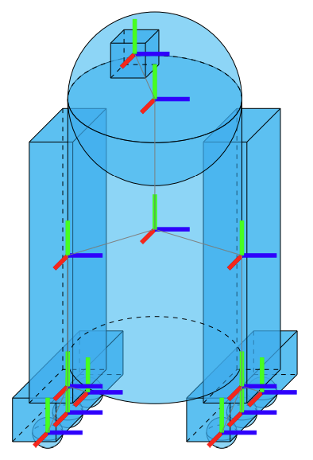

# **Nome do Robô:** Aplicação do robô

Trabalho de Interação Humano-Robô (IHR) apresentado ao Centro Universitário [FEI](https://portal.fei.edu.br/), como parte dos requisitos necessários para aprovação na disciplina de Interação Humano-Robô (IHR) (CCR230) do curso de Engenharia de Robôs, orientado pelo Prof. Dr. [Fagner de Assis Moura Pimentel](https://github.com/fagnerpimentel).

## Componentes do Grupo

- Bruno Matoba
- Caio
- Felipe

## Resumo

Um robô cão guia, que auxilia o deficiente visual no dia a dia e passar segurança de modo que o usuário sinta-se a vontade em locomover em um ambiente externo sem necessariamente precisar de um ajudante. 

## Introdução

- Apresente uma contextualização para o problema que o seu robô irá resolver e por quê esse tipo de robô é necessário hoje na sociedade.
- Apresente uma breve descrição do seu robô e sua aplicação (tarefa que ele irá resolver).
- Em uma única frase, resuma o objetivo do seu robô.
- Que tipo de experiência o robô deve proporcionar para os usuários?

## Publico Alvo

- Voltado para pessoas que tem deficiência visual e precisa de ajuda para se locomover em um ambiente externo.

### Personas

Persona Primária – Usuário com deficiência visual
	-Pessoa cega ou com baixa visão que quer se locomover com autonomia.
	-Usa tecnologias auxiliar no dia a dia.
	-Vive em áreas urbanas com tráfego intenso.
	-Robô precisa saber: grau de deficiência, preferências de feedback, destino ou rota desejada.
	
Persona Secundária – Cuidador/Familiar
	-Auxilia o usuário cego, preocupado com sua segurança.
	-Quer confiabilidade e monitoramento remoto.
	-Tem rotina que nem sempre permite acompanhar o usuário.
	-Robô precisa saber: contatos de emergência e permissões de notificações.

Outras Personas – Pedestres/Agentes Externos
	-Pessoas que circulam no mesmo ambiente.
	-Precisam perceber que o robô está guiando um deficiente visual.
	-Robô precisa apenas sinalizar visual/sonoramente que está em serviço.	

### Mapa de empatia

  ## Mapa de Empatia do Cão Guia
   
  ## Persona Primaria
  O que ele Pensa e Sente? : o que realmente conta, principais preocupações e aspirações.
  - O usuário sente-se seguro enquanto está utilizando o cão guia para auxílio durante a locomoção em ambientes externos,  de modo que o usuário fique calmo, não ansioso em lugar desconhecido ou não tem costume de passar por lá.

  O que ele Escuta? : o que amigos dizem, o que o chefe fala, o que influenciadores dizem.
  - Sons de carros, buzinas, passos de pessoas, alertas sonoros do robô sobre obstáculos, mudanças de direção ou travessia de ruas.
  
  O que ele vê? : ambiente, amigos, o que o mercado oferece.
  - O usuário percebe obstáculos pelo toque, sons do ambiente e sinais do robô.
    
 O que ele Fala e Faz? : atitude em público, aparência, comportamento com outros.
  - Dá comandos ao robô (“vire à esquerda ou vire à direita”, “pare”), segue o robô com confiança.

 Dor: medos, frustações, obstáculos?
  - Medo de acidentes, dificuldade de locomoção em locais desconhecidos, sinais do robô confusos.

 Ganhos: desejos e necessidades, formas de medir sucesso, obstáculos?
  - Maior autonomia, confiança ao caminhar “sozinho”, facilidade para navegar em ambientes variados.

## Persona Secundária
O que ele Pensa e Sente? : o que realmente conta, principais preocupações e aspirações.
  - Quer que o usuário seja seguro, independente e confortável.
  - Preocupa-se com a confiabilidade do robô.
  - Acompanha passeios iniciais.
  - Fornece suporte em caso de emergência.
    
O que ele Escuta? : o que amigos dizem, o que o chefe fala, o que influenciadores dizem.
  - Comentários de amigos e familiares sobre segurança do usuário.
  - Preocupa-se com a confiabilidade do robô.

O que ele vê? : ambiente, amigos, o que o mercado oferece.
  - Monitora a segurança e a eficiência da navegação.
  - Observa o usuário interagindo com o robô.

O que ele Fala e Faz? : atitude em público, aparência, comportamento com outros.
  - Robô seguro, confiável e fácil de utilizar.
  - Alertas  sobre obstáculos e falhas.
  - Sistema de monitoramento remoto.

Dor: medos, frustações, obstáculos?
  - Insegurança sobre a autonomia do usuário.
  - Dificuldade de monitoramento remoto.  

Ganhos: desejos e necessidades, formas de medir sucesso, obstáculos?
  - Segurança para o usuário.
  - Redução da necessidade de acompanhamento constante.

## Contexto de uso

- Descreva o ambiente em que o robô interage com os usuários
- Qual/quais o(s) contexto(s) sociais, econômicos e culturais existentes neste ambiente?
- Quais informações sobre o ambiente o robô deve saber antes de iniciar a tarefa?

## Jornada do usuário

- Criar uma narrativa para o o seu robô e o usuário.
- Determine o passo a passo que o usuário realiza desde o primeiro até o último encontro com robô na realização da tarefa.
- O que está acontecendo com o ambiente quando o robô está interagindo com o usuário?
  - Descreva o que acontece ou pode acontecer passo a passo
  - Como a tarefa começa? Como a tarefa evolui? Como a tarefa termina?
- Enfatize todos os momentos em que acontece uma interação verbal, não-verbal e espacial.

## Análise de concorrência

1. Glide (Glidance – EUA)

É um dispositivo autônomo de mobilidade feito especialmente para cegos ou pessoas com baixa visão. Ele funciona como uma espécie de carrinho que a pessoa segura e o robô vai guiando, desviando de obstáculos, degraus e portas, tanto em ambientes internos quanto externos.
	•	Pontos fortes: alternativa prática ao cão-guia, já com pré-venda internacional, preço mais acessível que um cão real (cerca de US$ 1.499), interface amigável.
	•	Limitações: ainda em fase inicial de comercialização, autonomia de bateria limitada, pode ter dificuldades em terrenos irregulares.

2. Lysa (Brasil – Vix Systems)

É um robô guia brasileiro, parecido com uma pequena mala com rodas e uma alça. O usuário segura a alça e o robô vai à frente, detectando obstáculos, buracos no chão e até obstáculos aéreos. Pesa cerca de 4 kg e tem autonomia de uso de 6 horas.
	•	Pontos fortes: feito pensando na realidade brasileira, mais leve e portátil, desenvolvido para uso cotidiano.
	•	Limitações: ainda em desenvolvimento, custo de produção pode ser alto, pouca difusão no mercado.

3. RoboGuide (Universidade de Glasgow, Escócia)

Projeto acadêmico em parceria com instituições de apoio a deficientes visuais. É um robô que funciona como um “cão guia artificial”, utilizando sensores e câmeras para guiar o usuário em ambientes internos.
	•	Pontos fortes: apoio institucional forte, custo de produção estimado menor que um cão real, já com protótipos funcionais.
	•	Limitações: ainda restrito a ambientes internos, não foi amplamente comercializado, depende de mapas e infraestrutura para melhor desempenho.

4. Robô cão-guia da China (Universidade Jiao Tong, Shanghai)

Um robô de seis patas inspirado em cães, equipado com sensores, reconhecimento de semáforos e planejamento de rotas com inteligência artificial. A ideia é que ele consiga guiar usuários em ambientes urbanos complexos.
	•	Pontos fortes: alta estabilidade por ter seis patas, reconhecimento de sinais de trânsito, projeto ambicioso para uso urbano.
	•	Limitações: ainda em fase de testes, custo de desenvolvimento elevado, peso e portabilidade são desafios.

## Design

- Pense nas características de Affordances do seu robô. Que tipo de acessibilidades devem ser consideradas dentro do seu projeto?
- Discuta o papel das expectativas do usuário no projeto de um robô. Qual a importância e pontos a serem considerados se você quiser vender esse robô  seu robô?
- O seu robô tem um padrão com mais ou menos características antropomórficas? Qual padrão é mais aceito pela sociedade dentro do projeto que você está desenvolvendo?
- Quais o design mais apropriado para o robô deste projeto? Modele o seu robô com desenhos de formas primitivas (caixas, cilindros, esferas)

<!--  -->
<!--  -->

## Ações do robô

-Detecta e desvia de obstáculos para conduzir o usuário com segurança.
-Para próximo de faixas de pedestre e sinaliza quando é seguro atravessar.
-Indica direções por som para orientar mudanças de caminho.
-Sinaliza com luzes ou sons que está guiando uma pessoa com deficiência visual, aumentando a segurança ao redor.

## Interações do robô

### Espacial

Interação 1 – Desvio de Obstáculo
	Descrição: O robô detecta um obstáculo à frente e muda de rota suavemente, guiando o usuário com segurança.
	Pré-requisitos:
		-Sensores funcionando (LIDAR, câmeras ou ultrassom).
		-Mapeamento do ambiente ativo.
		-Usuário segurando a guia do robô.
	Resposta emocional: Usuário sente confiança, alívio e segurança por não precisar se  preocupar em desviar e sim seguir o guia.
	
Interação 2 – Parada em Faixa de Pedestre
	Descrição: O robô identifica a faixa de pedestre, para e sinaliza ao usuário que é seguro atravessar.
	Pré-requisitos:
		-Detecção correta de faixas e semáforos.
		-Algoritmo de decisão sobre travessia.
	Resposta emocional: Usuário sente segurança, autonomia e tranquilidade.

### Verbal

Interação 1 – Comando “Ir para casa”
	Descrição: O usuário diz “Ir para casa” e o robô calcula a rota e guia até o destino.
	Pré-requisitos:
		-O	Sistema de reconhecimento de voz ativo.
		-O	GPS ou mapa do trajeto armazenado.
	Resposta emocional: Usuário sente autonomia, satisfação e praticidade.
	
Interação 2 – Alerta verbal de obstáculo
	Descrição: O robô anuncia “Obstáculo à frente” em voz clara.
	Pré-requisitos:
		-Sensores detectando obstáculos em tempo real.
		-Sistema de síntese de fala funcional.
	Resposta emocional: Usuário sente atenção reforçada e confiança no robô.

### Não-verbal

Interação 1 – Vibração para mudança de direção
	Descrição: O robô vibra na alça ou guia para indicar que vai virar à esquerda ou direita.
	Pré-requisitos:
		-Motor de vibração funcionando.
		-Mapeamento do caminho previamente calculado.
		-Resposta emocional: Usuário sente clareza nas instruções, reduz ansiedade e aumenta confiança.

Interação 2 – Luz indicadora para terceiros
	Descrição: O robô acende uma luz de alerta (LED) para sinalizar que está guiando um deficiente visual.
	Pré-requisitos:
		-Sistema de LEDs instalado.
		-Energia suficiente na bateria.
		-Resposta emocional: Usuário sente-se protegido, aumentando sua sensação de segurança.

[^1]: Fonte: Adaptado de <https://hazeshift.com.br/mapa-de-empatia/>

<!-- TODOs:
- Add exemplos
 -->
